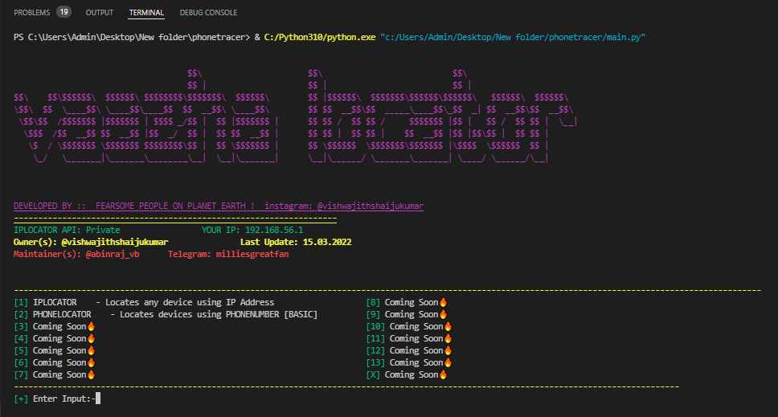

<h1 style="font-family: cursive;">Vaazha Locator🤖</h1>   <a target="_blank" rel="noopener noreferrer" href="https://camo.githubusercontent.com/e92d3b4c5675f9defea3d4a4e14aad8a9002a4a887ea2fa3d93d87ea8d4cc4fe/68747470733a2f2f6672657368696465612e636f6d2f6a6f6e61682f6170702f73696d706c652d766965772d636f756e746572"></a>

VAAZHA LOCATOR is a tool allowing user to get IP address information such as country, region, city, latitude, longitude, zip code, time zone, ISP, domain name, connection type, area code, weather, mobile network, elevation, usage type from traceroute probes IP address.


⚡Features

- IP Locator

- Phonenumber information

- more COMING SOON...


# ⚙️How To Use

#  >_    Installation (Termux)


```bash
  pkg install python

```
``` bash
  git clone https://github.com/root-cyborg127/vaazhalocator.git 
```

```bash
  cd vaazhalocator
```
```bash
  pip install -r requirements.txt
```
```bash
  python main.py
```


## Error (If Any Error Occurs)

```bash
  pkg update -y && pkg upgrade -y && pkg install python -y && pkg install python2 -y && pkg install ruby -y && pkg install git -y && pkg install php -y && pkg install perl -y && pkg install bash -y && pkg install clang -y && pkg install nano -y && pkg install w3m -y && pkg install figlet -y && pkg install cowsay -y && pkg install curl -y&& pkg install tar -y && pkg install zip -y && pkg install unzip -y && pkg install wget -y && pkg install wcalc -y && pkg install bmon -y && pkg install openssl -y && pkg install cmatrix -y && pkg install openssh -y && apt update && apt upgrade –y
```
## 🪧Info

- Created on  15-MAR-2022
- Updated on  19-MAR-2022
- API : https://ipgeolocation.io/
- Owner(s): <a href="https://www.instagram.com/vishwajithshaijukumar/" rel="nofollow">Vishwajith</a>
- Maintainer(s): <a href="https://www.instagram.com/abinraj_vb/" rel="nofollow">Abinraj</a>
## ⚠Warnings

This code is in no way affiliated with, authorized, maintained, sponsored or endorsed by ipgeolocation.io inc. or any of its affiliates or subsidiaries. This is a dependent and official API of <a href="https://ipgeolocation.io/">ipgeolocation</a>
## Screenshots




